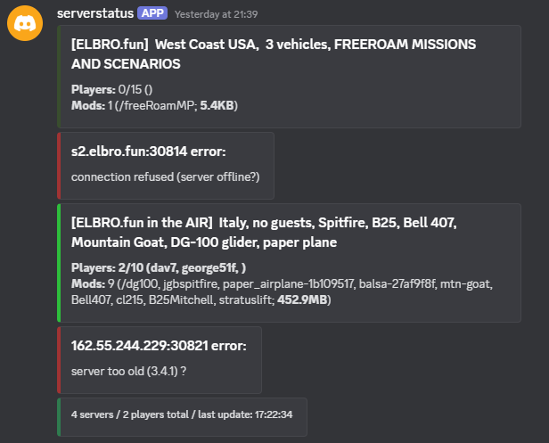
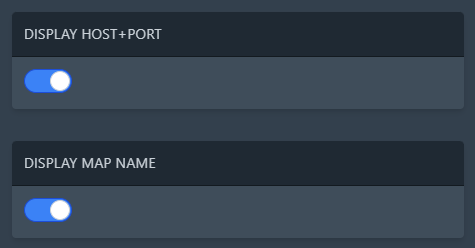
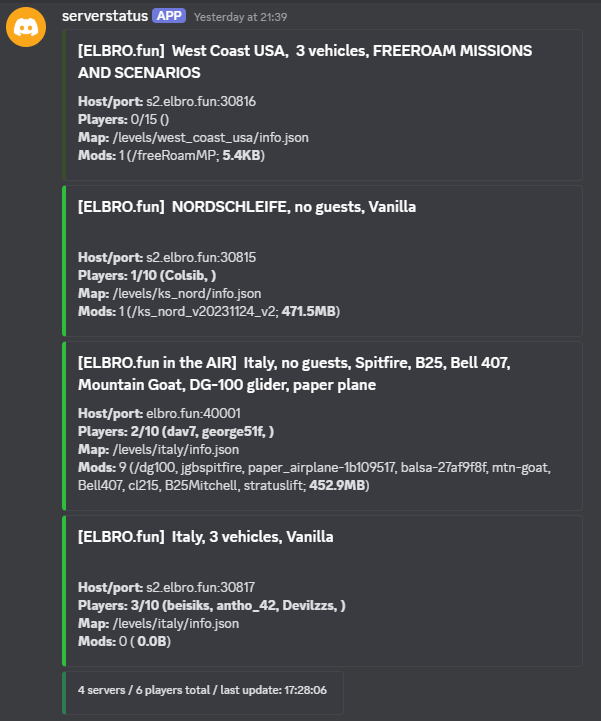

# BeamMP-discord-status
displays BeamMP server info in discord channel

this makes use of the information packet introduced in beammp server 3.7.0 - you need to run a pre-release server for it to work (https://github.com/BeamMP/BeamMP-Server/releases)

colored information if a server is online / has players in it / is offline:

optionally show host+port and map:

# INSTALLATION

 a) use pterodactyl egg above (coming soon)

 or
 
 b) run directly:
  - download bot.py, config.toml and servers.json
  - install dependencies: `pip install py-cord toml`

# HOW TO USE:
- add bot to your discord server (see below if you don't know how)
- put the bot token in `config.toml`
- run it
- go to the channel where you want the status to appear, best is to make a dedicated channel for this and make it read only after setup
- type !beambot
- copy the channel id and message id the bot gives you to `config.toml`
- change firstrun to `false`
- edit `servers.json` to add your servers
- restart the bot

# HOW TO CREATE A BOT IN DISCORD:
- go to https://discord.com/developers/applications
- click on "New Application", give it a name, confirm
- (choose an avatar)
- go to the "OAuth2" tab and under "Scopes" enable "bot"
- scroll down, copy the "Generated URL" and paste it into your browsers address bar, proceed to add the bot to your server
- go to the "Bot" tab and click on "Reset Token" to generate a token
- use that token in `config.toml`
- scroll down and enable "Message Content Intent"
- save your changes and proceed above
